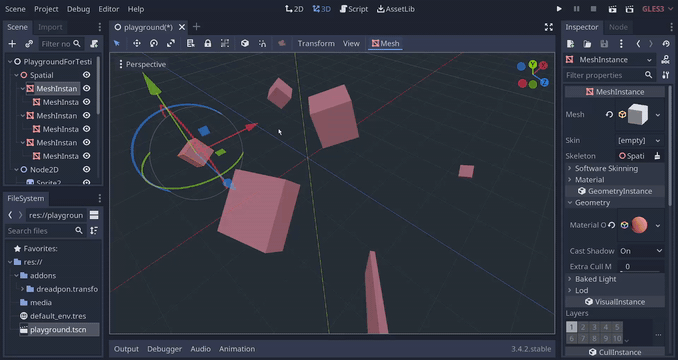

# Transform Transfer for Godot

A Godot plugin to transfer transformations from one node to another.

## What is it for?

Once I exported a level from Blender straight to Godot. And then I wanted to add physics bodies to my meshes. And then remodel them entirely. In the end, I realized I needed something to place these new objects in place of the already imported ones. That's how this plugin was born. 

Current version can transfer all the transformations (position, rotation, scale) between two or more Spatial/Node2D/Control nodes, no matter how these objects are parented.

This is potentially usefull when building levels from 3rd-party made layouts/whiteboxes using actual assets, or when you just need to snap two objects together.

## Installation

This plugin is installed the same way as other Godot plugins.

Copy the folder `addons/dreadpon.transform_transfer/` to `res://addons/` in your Godot project and enable it from `Project -> Project Settings -> Plugins`.

## Support

This plugin was developed and tested using Godot v3.4.2, but should work fine on most 3.x versions.

## Usage

1. Open any scene in your project.
2. Select 2 or more nodes of the same type.
    - Supported types are: `Spatial`, `Node2D`, `Control` and all their subclasses.
    - Make sure to explicitly select the last node. It becomes the **source** from which the transformations are taken.
    - All **other** nodes will have their global transforms set to that of the **source**.
3. Click `Transfer Transforms` in the toolbar.
4. In the popup menu:
    - Choose which transforms you want to transfer: `Translation`, `Rotation`, `Scale` or any combination of these.
    - Choose which scale handling method to use when non-uniform scaling is detected.
5. When you're done, click `Transfer` in the same menu.
6. All your nodes should snap to source node and become of the same size and orientation.

## Additional notes

* It's important to explicitly select the last **source** node (`Ctrl + Click` instead of `Shift + Click`) since it looks like Godot doesn't have native selection ordering. Otherwise, any newly selected node might become the source.
* Non-uniform scaling is not supported since it's (probably) impossible to accurately represent non-uniform scaling of differenly oriented objects. If that ever happens, plugin will normalize the scale. There are a few different options for how this uniform value is chosen:
    - `Average`      - calculates the average of all scale axes       (e.g. `(1.5, 2.1, 0.6)` becomes `(1.4, 1.4, 1.4)`)
    - `Use Min Axis` - uses the smallest value to set the whole scale (e.g. `(1.5, 2.1, 0.6)` becomes `(0.6, 0.6, 0.6)`)
    - `Use Max Axis` - uses the largest value to set the whole scale  (e.g. `(1.5, 2.1, 0.6)` becomes `(2.1, 2.1, 2.1)`)
* `Control` nodes don't behave in the same way as `Spatial` or `Node2D`. They obey their anchors, margins and containers, so aligning two Controls in global space makes little sense.
    - For completeness sake, you can transfer most transformation-related attributes between `Control` nodes, but they are merely copied and pasted. The layout will decide how these nodes are actually placed.
    - The only attribute that actually *can* have global transformations is `Position`. Transfering this attribute **will** align nodes, unless other `Controls` force a different layout.
